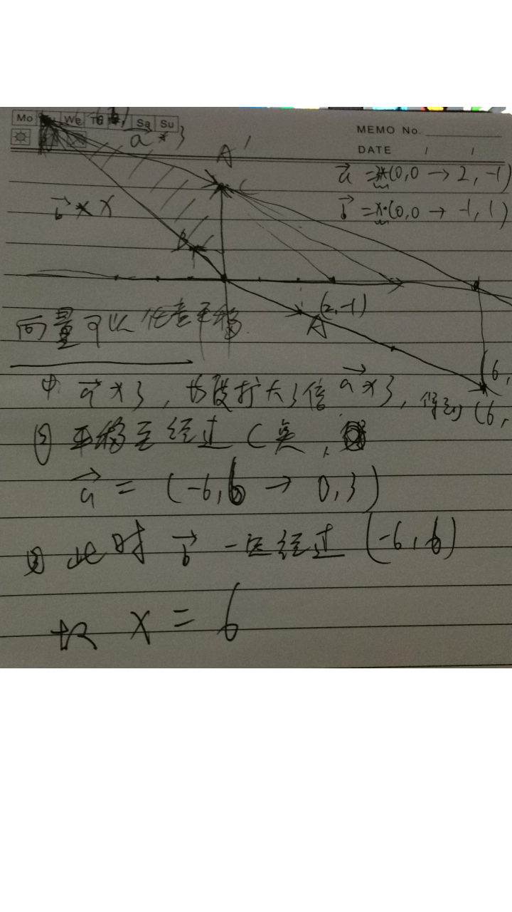

# Vector
[Vector Space](https://en.wikipedia.org/wiki/Vector_space)
```


  B---------C
 /         /
O-------->A

->   ->    ->
OB + OA  = OC


O---->A(O)--------->B               

A<----O---------->B           

Assume:
    
    O------A    

    ->    ->            ->    ->
    a   = OA   then   - a   = AO   // 

Then:
    ->     ->     ->    ->
    a   +  b  =   b   + a
    ->  ->  ->    ->  ->   ->   ->   ->  -> 
    a + b + c  = (a + b) + c  = a + (b + c)

```


```
   ->           ->
|λ a|   = λ  * |a|    , λ > 0

  ->    ->
λ a   = 0     , λ = 0

   ->          ->
|λ a| = |λ| * |a|

```

```
   ->    ->       ->                               ->            ->   ->
If b  = λa , then a is parallel (may coincide) with b, written as a // b 

              ->   ->      ->  ->
If λ ≠ 0 and λa = λb, then a = b
   ->
If a ≠ 0 and λa = μa, then λ =μ
```


```
VectorA(3 * (0,0->2,-1))  +  VectorB (λ * (0,0->-1,1))  = VectorC(0,0->0,3)
```


```
Solve:
    ->                                     -->
    a   =  3 * (0,0->2,-1)  = (0,0->6,-3)  OA' 
               [2]          [6]
        =  3 * [-1]  =      [-3]
        
        -->
    Now A'C (6,-3->0,3)    ==> 6x - 3y = 0x + 3y   ==> 6(-x + y) = 0
    So  -->      ->
        A'C  = λ b  ,  and λ = 6
```
